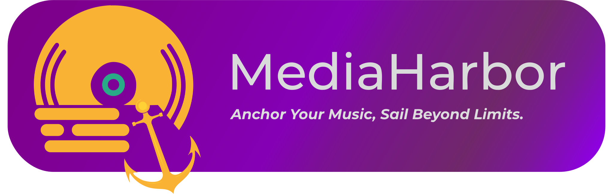

# MediaHarbor

[](https://tauri.app/)[](https://www.rust-lang.org/)[](https://www.typescriptlang.org/)
  
 [](https://discord.gg/Kc97D86TeZ)


MediaHarbor is an all-in-one media downloader and player. Search, stream, and download audio/video from YouTube, Spotify, Tidal, Deezer, Qobuz, Apple Music, and more.

---

## Table of Contents

- [Features](#features)
- [Supported Platforms](#supported-platforms)
- [Prerequisites](#prerequisites)
- [Installation](#installation)
- [Building from Source](#building-from-source)
- [In-App Dependency Setup](#in-app-dependency-setup)
- [Known Issues](#known-issues)
- [Contributing](#contributing)
- [License](#license)

---

## Features

- **Search** across all supported platforms from a single interface
- **Download** tracks, albums, playlists, and videos at your chosen quality
- **Stream** directly inside the app with a built-in audio/video player
- **Lyrics** — synced (LRC), plain text, and word-by-word display where available
- **Local library** — scan a folder and browse your downloaded media by album/artist
- **Automatic dependency management** installs yt-dlp, ffmpeg, Python, votify, gamdl, and more from the Dependencies page
- **OrpheusDL integration** optional backend for platform downloads via modular support
- **In-app settings editor** — configure all platform credentials without touching config files

---

## Prerequisites

Before building, make sure you have:

- **Node.js** ≥ 18 and **npm**
- **Rust** (stable toolchain) — install from [rustup.rs](https://rustup.rs/)
- Tauri system dependencies for your OS — see the [Tauri v2 prerequisites guide](https://tauri.app/start/prerequisites/)

On Linux you also need: `libwebkit2gtk-4.1-dev`, `libssl-dev`, `libayatana-appindicator3-dev`, `librsvg2-dev`

---

## Building from Source

### 1. Clone the repository

```bash
git clone https://github.com/MediaHarbor/MediaHarbor.git
cd MediaHarbor
git checkout tauri-migration
```

### 2. Install dependencies

```bash
npm install
```

### 3. Run in development mode

```bash
npm run tauri:dev
```

This starts the Vite dev server and the Tauri process concurrently.

### 4. Build a production binary

```bash
# Linux only (.deb, .rpm, .AppImage)
npm run tauri:build:linux

# Windows only (.msi, .exe)
npm run tauri:build:win

# macOS (universal or targeted)
npm run tauri:build:mac
npm run tauri:build:mac:x64
npm run tauri:build:mac:arm64
```

The output is placed in `src/app/target/release/bundle/`.

---

## In-App Dependency Setup

MediaHarbor manages its own tool dependencies through the **Dependencies** page inside the app. On first launch, open the Updates tab and install what you need:

- **Python / yt-dlp** required for YouTube and YouTube Music downloads
- **ffmpeg** required for muxing and format conversion
- **votify + Bento4** required for Spotify downloads (cookies also needed in Settings)
- **gamdl + Bento4** required for Apple Music downloads (cookies also needed in Settings)
- **OrpheusDL + modules** optional alternative backend for platform downloads

Platform credentials (Tidal OAuth, Deezer ARL, Qobuz login, Spotify/Apple cookies) are all configured from the **Settings** page.

---

## Known Issues

- Library page may not work properly for big folders
- Apple Music streamings haven't added yet
- Synced lyrics may get out of sync due on Windows and some tracks

---

## Contributing

Contributions are welcome. Please open an issue before submitting a pull request for larger changes. For smaller fixes, a PR is fine directly.

---

## License

GPL-3.0 — see [LICENSE](LICENSE) for details.